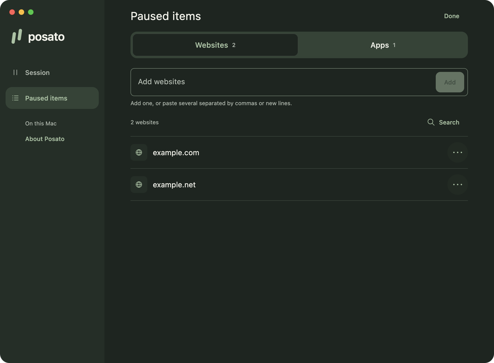
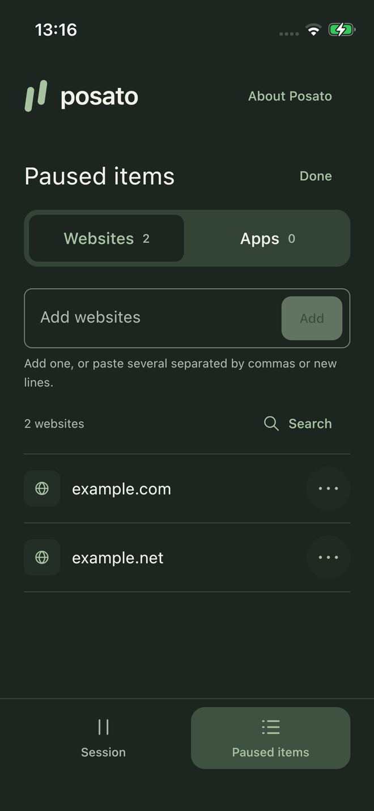
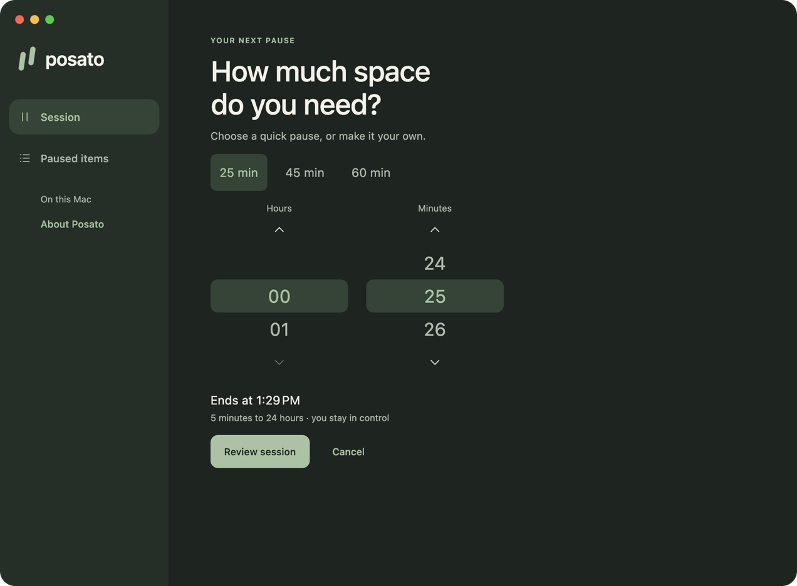
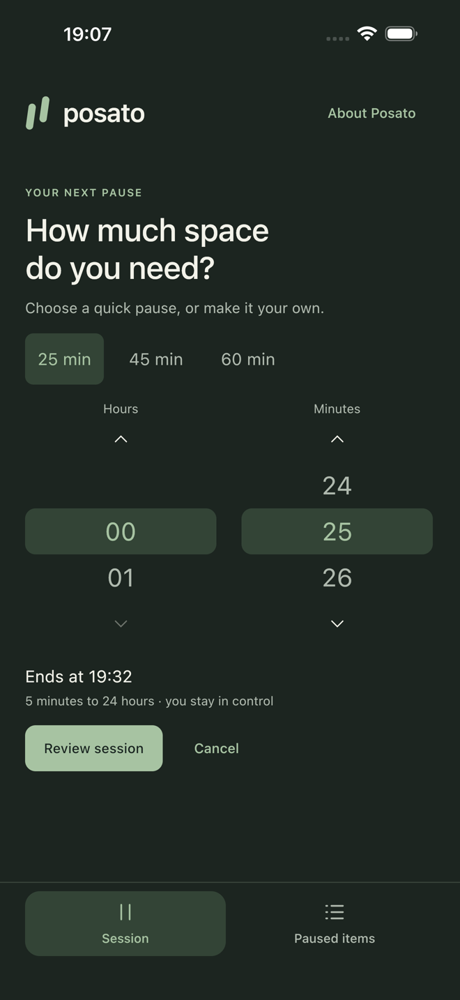

# Posato

**Pause. Then choose.**

Choose the websites and apps you want to step away from, then take a timed
pause on your Mac or iPhone.

<p align="center">
  
</p>

[Quick start](#quick-start) · [How it works](#how-it-works) ·
[Limits](#limits) · [Privacy](#privacy) · [Documentation](#project-documentation)

No Posato account, no analytics, and no Posato-operated server.
Open source under the [Apache License 2.0](LICENSE).

## Quick start

Posato is **pre-release**. There is no official download yet:

| Platform | Planned channel | Availability |
| --- | --- | --- |
| macOS | Signed and notarized download (Developer ID) | Not available yet |
| iOS | App Store | Not available yet |

Build from source for development and evaluation using the steps below.
Release readiness is tracked in the
[first-release readiness record](docs/tasks/executions/release-001-first-release-readiness.md).

Requirements:

- A Mac with Apple silicon, Xcode, and an iOS Simulator runtime that supports
  iPhone 17 (used by the test suite).
- Java 17 or later to launch Gradle, installed system-wide or through
  `JAVA_HOME` so that Xcode build phases can find it; the build downloads the
  JDK 21 it uses.
- Android SDK Platform 36 and Build Tools 36.0.0, with `ANDROID_HOME` pointing
  to the SDK. It is used only for shared Compose previews; Posato is not an
  Android app.

Clone the repository, then run:

```shell
git clone https://github.com/dees91/posato.git
cd posato
./gradlew :desktopApp:run      # run the macOS app
./gradlew quality              # formatting, analysis, tests, and packaging checks
```

Build the iOS app for the Simulator:

```shell
xcodebuild -project iosApp/iosApp.xcodeproj -scheme iosApp \
  -sdk iphonesimulator -destination 'generic/platform=iOS Simulator' \
  CODE_SIGNING_ALLOWED=NO CODE_SIGNING_REQUIRED=NO build
```

These steps need no Apple credentials, and the apps run without blocking or
sync. Blocking, the macOS helper, and iCloud sync need Apple Development signing
with the Posato app identifiers, iCloud container, and App Group, which are
registered to the Posato developer team; building signed variants under another
team currently requires changing those identifiers throughout the project. The
iOS Simulator cannot use Screen Time controls. See the
[development guide](docs/development/README.md) and
[Apple development provisioning](docs/development/apple-provisioning.md).

## How it works

### Choose what to pause

Add exact website domains, then choose apps on each device. App choices stay
on that device; only the shared app group name synchronizes.

<p align="center">
  
  
</p>

### Make a little space

Set a duration from **5 minutes to 24 hours**, review your choices, and start
the session. It ends at the selected time, subject to the
[iPhone cleanup limits](#limits), or when you deliberately end it early.

<p align="center">
  
  
</p>

Screenshots and demo use synthetic choices in the real apps. The iPhone
duration image comes from the Simulator; active-session images come from
the Mac and a physical iPhone, in separate local sessions.

### Share the session with iCloud

Choose **Sync with iCloud** on your Mac and iPhone, signed in to the same Apple
Account, to share your website list and sessions. No QR code or invitation is
needed. Delivery is best effort, and the Mac needs administrator approval
before blocking starts.

The core flow was [verified end to end on one Mac and one iPhone](docs/tasks/executions/mvp-001-end-to-end-acceptance.md),
including blocking, early end from either device, expiry, relaunch, and a
device that was offline during a session.

## Limits

Posato adds deliberate friction; it is not a lock you cannot open.

- It does not resist a device administrator and can always be removed. Ending a
  session early is always possible.
- On macOS, blocking works only while Posato is running. If Posato quits, or
  after sleep, wake, or a network change, blocking stops until you resume it in
  Posato with administrator approval. A session received from your iPhone also
  needs that approval before the Mac blocks anything.
- On macOS, paused apps are quit while a session is active, including apps that
  were already open when it started, so unsaved work in them can be lost.
- On macOS, website blocking covers **Safari** and **Google Chrome Stable** for
  web traffic on ports 80 and 443 while they use the system proxy settings.
  Firefox, other browsers, in-app browsers, and apps that bypass the system
  proxy are not covered. Visiting a paused site by its IP address is not
  blocked, and iCloud Private Relay can bypass blocking without being detected.
  A session does not start blocking while a VPN or a manually configured proxy
  is active. Pages already loaded, cached, or downloaded are not erased, and the
  pause page may occasionally not appear even though the site stays blocked.
- On macOS, Posato uses a background helper that requires administrator approval
  and may ask for Automation permission to show its pause page in the current
  tab.
- On iPhone, the system clears restrictions after a session ends and may keep
  them for a while past the end time. Sessions shorter than 15 minutes are
  cleared only when Posato is open at the end or when you open it again.
- Sync is best effort. Posato cannot promise when, or whether, a change reaches
  your other device, and it cannot wake a sleeping device.
- If every copy of the workspace key is lost, synchronized data cannot be
  recovered. Data already copied to another device cannot be erased remotely.

## Supported platforms

- macOS 15 or later on Apple silicon.
- iOS 18 or later.

Posato targets the current and previous major versions of macOS and iOS. The
exact release test matrix is still being confirmed.

## Privacy

Posato does not collect your data. Your websites, app choices, and sessions stay
on your devices; with iCloud sync on, changes are encrypted on your device
before they are stored in your private iCloud database. See the
[privacy policy](PRIVACY.md).

## Support and security

- Report bugs, ask questions, and share ideas in [GitHub Issues](../../issues).
  Please do not include website names, app names, device details, screenshots,
  or logs.
- Report security vulnerabilities privately, as described in the
  [security policy](SECURITY.md).
- Pull requests are not accepted at the moment; see
  [contributing](CONTRIBUTING.md).

## Project documentation

- [Development guide](docs/development/README.md) and
  [engineering quality contract](docs/development/engineering-quality-contract.md)
- [MVP scope](docs/product/mvp-scope.md) and [design system](DESIGN.md)
- [Architecture decisions](docs/decisions/) and
  [threat model](docs/security/apple-mvp-threat-model.md)
- [Project wiki](docs/wiki/index.md), including feasibility results that informed
  the design, and the [task workflow](docs/tasks/README.md)

## License

Posato is licensed under the [Apache License 2.0](LICENSE). See [NOTICE](NOTICE)
and [third-party notices](THIRD_PARTY_NOTICES.md).
