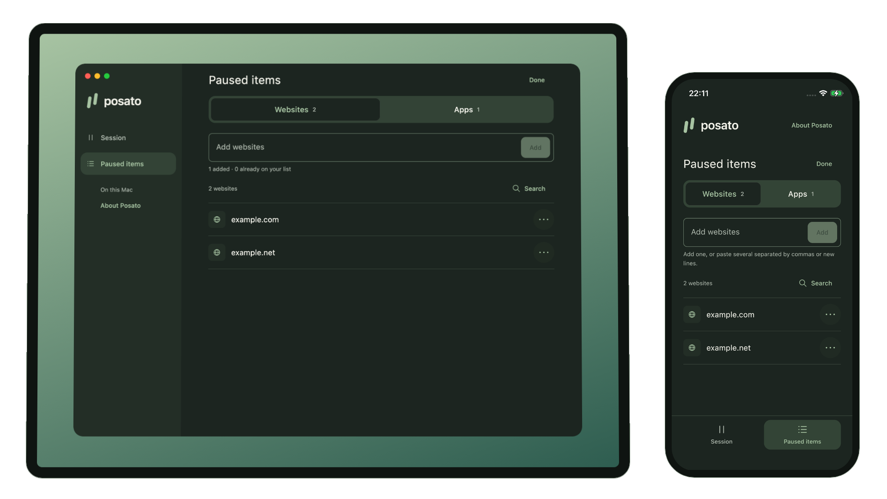
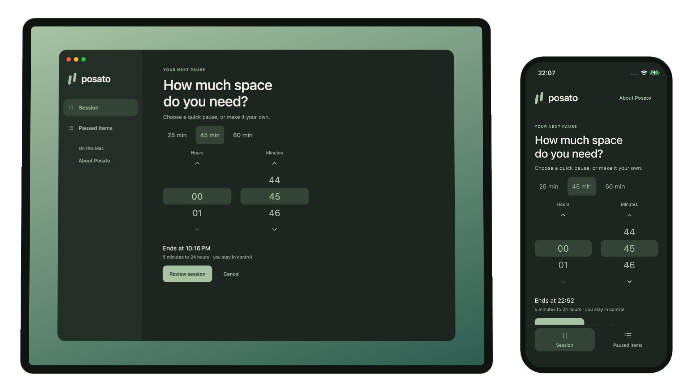

# Posato

**Pause. Then choose.**

Posato blocks the websites and apps you choose for a timed pause on your Mac
or iPhone, within the [limits](#limits) below.

  

Watch the [full 42-second walkthrough](https://posato.app/media/walkthrough.mp4),
which adds the Mac app picker, the review screen, and ending a session early.

[Quick start](#quick-start) · [How it works](#how-it-works) ·
[Limits](#limits) · [Privacy](#privacy) · [Documentation](#project-documentation)

No Posato account, no analytics, and no Posato-operated server.
Open source under the [Apache License 2.0](LICENSE).

## Quick start

  
  

- **Mac:** download the signed and notarized DMG from
  [GitHub Releases](https://github.com/dees91/posato/releases/latest), open it, and move Posato to your Applications folder.
  Posato 1.1 and later can check for updates after you agree; to move from 1.0,
  quit Posato and replace it with the new version.
- **iPhone:** install Posato from the [App Store](https://apps.apple.com/app/posato/id6812237585).

Posato targets **macOS 15 or later on Apple silicon** and **iOS 18 or later**;
the [platform matrix](docs/product/limits-and-platforms.md#supported-platforms)
records what was checked on each of them. Intel Macs, Android, Linux, and Windows are
[planned for later releases](docs/product/limits-and-platforms.md#planned-platforms).

To build it yourself, follow the [build instructions](docs/development/README.md#build-from-source).
Unsigned builds let you explore the apps; blocking and sync require Apple
Development signing. The iOS Simulator cannot use Screen Time controls.

## How it works

### Choose what to pause

Add exact website domains, then choose apps on each device. App choices stay
on that device; only the shared app group name synchronizes.

  

### Start a timed pause

Set a duration from **5 minutes to 24 hours**, review your choices, and start
the session. Posato blocks your chosen websites and apps on that device,
within the [limits](#limits) below. It ends at the selected time or when you
deliberately end it early. On iPhone, restrictions can linger after it ends.

  

Screenshots and the demo show synthetic choices in the real apps; see the
[capture provenance](video/README.md#capture-provenance).

### Share the session with iCloud

Choose **Sync with iCloud** on one Mac and one iPhone signed in to the same
Apple Account to share your website list and sessions. No QR code or invitation
is needed. Delivery is best effort, and the Mac needs administrator approval
before blocking starts.

## Limits

Posato adds deliberate friction; it is not a lock you cannot open.

- **Mac:** blocking works while Posato runs, including in the menu bar with
  its window closed. Quitting Posato stops it. Starting or resuming blocking
  needs administrator approval. Paused apps are quit, so save your work first.
  Website blocking covers Safari and Google Chrome Stable using the system
  proxy.
- **iPhone:** restrictions can linger after a session ends. For sessions under
  15 minutes, they clear only when Posato is open at the end or the next time
  you open it.
- **Sync:** delivery is best effort. If every copy of your workspace key is
  lost, synchronized data cannot be recovered.

Read the [full blocking and sync limits](docs/product/limits-and-platforms.md#limits)
for browser coverage, VPN and Private Relay behavior, resuming after sleep,
and data recovery boundaries.

## Privacy

Posato does not collect your data. Your websites, app choices, and sessions stay
on your devices; with iCloud sync on, changes are encrypted on your device
before they are stored in your private iCloud database. On Mac, update checks go
to GitHub Releases only after you agree. See the [privacy policy](PRIVACY.md).

## Support and security

- Report bugs, ask questions, and share ideas in [GitHub Issues](../../issues).
  Please do not include website names, app names, device details, screenshots,
  or logs.
- Report security vulnerabilities privately, as described in the
  [security policy](SECURITY.md).
- Pull requests are not accepted at the moment; see
  [contributing](CONTRIBUTING.md).

## Project documentation

- [Development guide](docs/development/README.md) and
  [engineering quality contract](docs/development/engineering-quality-contract.md)
- [MVP scope](docs/product/mvp-scope.md) and [design system](DESIGN.md)
- [Architecture decisions](docs/decisions/) and
  [threat model](docs/security/apple-mvp-threat-model.md)
- [Project wiki](docs/wiki/index.md), including feasibility results that informed
  the design, and the [task workflow](docs/tasks/README.md)

## License

Posato is licensed under the [Apache License 2.0](LICENSE). See [NOTICE](NOTICE)
and [third-party notices](THIRD_PARTY_NOTICES.md).
