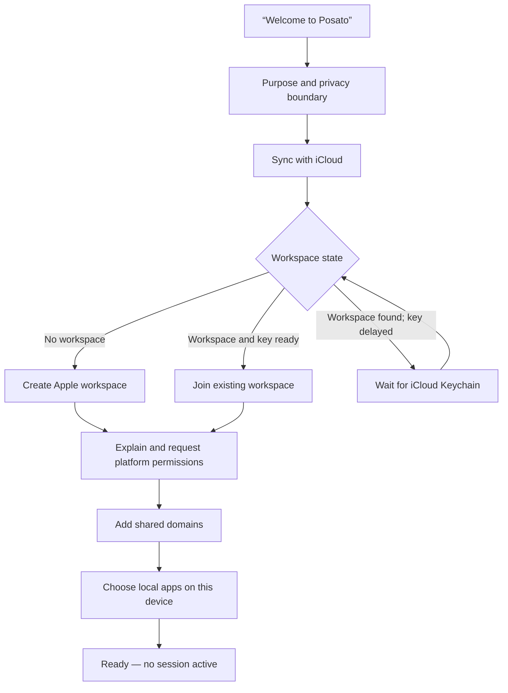
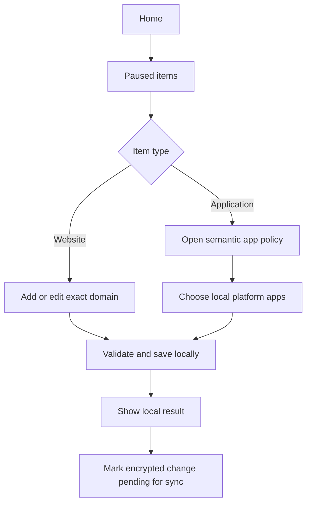
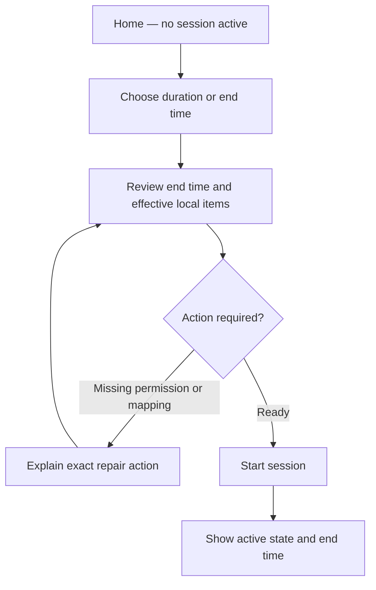
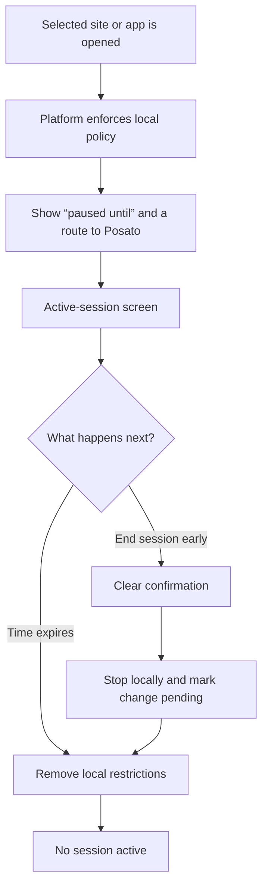
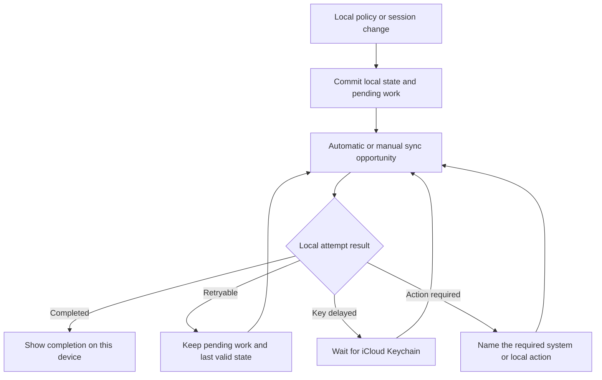
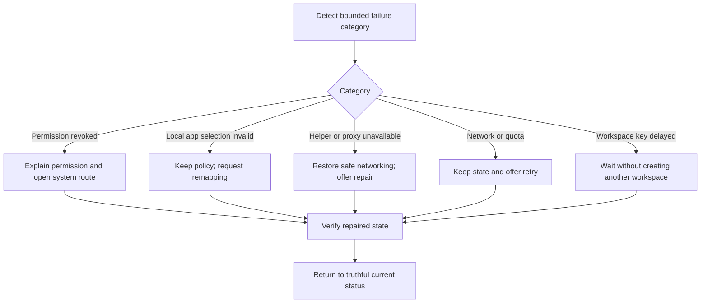

# Brand and Product Design Baseline

## Status and boundary

- **Status:** Accepted
- **Accepted:** 2026-08-25
- **Provenance:** `user-confirmed`
- **Decision authority:** [DESIGN.md](../../../DESIGN.md)

Agents must use `DESIGN.md` as the canonical contract for future brand,
product-design, UI, and application-shell work. This page retains the synthesis,
evidence, low-fidelity flows, and proposal history that support that contract.

`user-confirmed` (2026-09-07): the native prototype design is adopted for the
real MVP, with practically 1:1 presentation and a complete reusable Compose
component library adapted to existing ViewModels. The current exact palette,
typography, spacing, controls, iOS bottom navigation, and macOS sidebar/window
contract live in `DESIGN.md`. Historical proposals below do not compete with
that contract. Store artwork, custom typefaces, illustration, and marketing
remain outside this adoption.

`observed` (2026-09-07): physical keyboard verification found that chaining
generic `windowInsetsPadding(safeDrawing)` with Skiko `imePadding` in Compose
1.10.3 subtracts keyboard space twice; their consumption mechanisms differ.
The product root uses only the former. The modal selection sheet has a separate
dialog boundary that consumes and excludes IME before its content; native search
verification confirmed it does not require the same correction. Recheck these
boundaries when changing the Compose version or application shell.

As of 2026-09-06, the root `DESIGN.md` links to the separate
[prototype design reference](../../../prototypes/mvp-interaction-flow/DESIGN.md),
documenting its tokens, components, screen hierarchy, and behavior at the
maintainer's request (`user-confirmed`). Unlabelled root statements remain the
production contract; the prototype reference does not establish platform parity.
That evidence-only status for concrete presentation choices was superseded by
the explicit adoption on 2026-09-07. Mock services and unimplemented product
flows remain evidence only.

## Accepted first-install presentation

`user-confirmed` (2026-09-09): the maintainer accepted the isolated PR #44
UI proposal for production integration. It restores the prototype's interval
artwork and welcome hierarchy, replaces the full six-row progress list with
one step label/count, shortens privacy copy into icon-led rows, and keeps
compact actions reachable below scrolling content. Expanded text uses a
600 dp column within the existing outer canvas. The six-step sequence,
consent operations, persistence, and synchronization boundaries are unchanged.

`observed`: Screen Time authorization gates iOS website enforcement as well
as app enforcement; onboarding rationale therefore names both. Returned
ready states offer Continue, while unavailable versions omit impossible
settings-repair instructions. The continuing contract is the first-install
section in [DESIGN.md](../../../DESIGN.md); the frozen prototype remains
reference evidence. This acceptance does not adopt the separate suggestion
to shorten or reorder the six-step flow.

## Deferred Mac setup route

`observed` (PR #44 review): Session's Retry action reapplies enforcement; it
never invokes helper registration. The existing registration action is
**Enable on this Mac** during onboarding. Recovery copy must name that action,
not promise a Session setup control. Administrator approval applies to website
pauses, not every apps-only session.

`user-confirmed` (2026-09-09): the Session screen gains a macOS-only
**This Mac** section below Sync with iCloud, reachable after onboarding is
completed or deferred. It reads nothing before a press: **Check Mac setup**
runs one status read, then the section names the real state with one precise
action (Enable on this Mac, Open System Settings plus Check again, or a
positive enabled notice) and keeps a quiet Check again for every known state,
because the person can disable the background item in System Settings at any
time. A status read spawns the helper process, verifies its signature, and
wakes the root daemon when the service is enabled, so the app never reads it
at launch, foreground, or navigation; the first-install `pgrep` evidence keeps
holding.

`observed` (2026-09-09): `HelperResult.State.NotRegistered` now maps to the
distinct `NOT_ENABLED` readiness instead of unavailable, and both `enable()`
and `recheck()` verify the helper signature before touching the client. A
transport failure leaves the shared helper client with a pending unknown
request that rejects every later plain request, so Check again cannot recover
that case; the unavailable notice says to quit and reopen Posato. The
approval-required and not-enabled branches have unit evidence only on a Mac
whose helper is already approved.

## Accepted brand foundation

### Positioning

**Posato helps self-directed people interrupt automatic use of selected
websites and apps with calm, time-bounded limits across their own Apple
devices, without surveillance or a product account.**

### Primary audience

The primary audience is an adult who owns a Mac and iPhone, recognizes an
automatic digital habit, and wants deliberate friction under their own control.
Posato is not positioned as parental control, employee monitoring,
administrator security, or a productivity-scoring system.

### Promise and working line

- **Brand promise:** a quiet pause between impulse and action.
- **Working product line:** **Pause. Then choose.**

The product does not promise perfect prevention. It promises a clear,
respectful interruption and truthful state across the devices it supports.

### Personality

Posato is:

- calm, without drifting into wellness vagueness;
- respectful, without becoming passive;
- candid about platform limits and failure;
- precise about time, scope, and device state; and
- composed rather than playful or severe.

Posato is not punitive, paternalistic, moralizing, alarmist, gamified,
clinical, or framed around productivity guilt.

### Voice and product language

Use short, concrete sentences. Describe the current state first, the consequence
second, and an available action third. Address the person directly only when it
makes an action clearer. Never congratulate, shame, score, or diagnose them.

| Context | Recommended language | Avoid |
| --- | --- | --- |
| Inactive | “No session active.” | “You are unprotected.” |
| Active | “Session active until 18:30.” | “You are locked in.” |
| Blocked | “This site is paused until 18:30.” | “Access denied.” |
| Early end | “End session early” | “Give up” or “Break focus” |
| Local sync result | “Last sync completed on this device at 18:02.” | “Everything is synced.” |
| Key delay | “Waiting for iCloud Keychain. Your existing workspace remains unchanged.” | “Sync failed.” |
| Permission | “Posato needs Screen Time access to pause selected apps on this iPhone.” | “Permission required.” |

Use **session**, **paused**, **ends at**, **on this device**, **waiting**, and
**needs your attention** consistently. Reserve **blocked** for technical and
support contexts where precision outweighs tone. Do not use **detox**,
**addiction**, **discipline**, **streak**, or **failure** to describe a person.

## Accepted visual direction

### Concept: the calm interval

The defining visual idea is a visible interval between impulse and action. It
should feel like space deliberately opened, not a barrier imposed from outside.
Use restrained negative space, stable alignment, and one clear focal action.
Avoid shields, padlocks, stop signs, warning tape, flames, dopamine imagery,
achievement rings, and generic productivity dashboards.

### Base palette

These sRGB values are brand references, not instructions to replace Apple
semantic colors throughout the application.

| Token | Value | Intended role |
| --- | --- | --- |
| Posato Ink | `#18231F` | Primary brand text and dark neutral |
| Posato Paper | `#F5F2EA` | Warm light brand surface |
| Posato Moss | `#2E5D50` | Primary brand and application tint |
| Posato Clay | `#A54B35` | Secondary emphasis, never a generic error color |
| Posato Mist | `#DCE4DF` | Quiet supporting surface or illustration field |

`observed`: WCAG 2.x sRGB contrast calculations give 14.45:1 for Ink on
Paper, 6.71:1 for Moss on Paper, 7.51:1 for white on Moss, 5.13:1 for Clay on
Paper, and 5.74:1 for white on Clay. These pairs clear the 4.5:1 reference for
normal text, but every real component still requires state-specific contrast
testing.

Application surfaces and labels should use semantic system colors. Moss is the
single default tint for primary actions and selected state. Clay is a sparse
brand accent and must not compete with system warning or destructive colors.
Dark Mode and Increase Contrast require asset variants; candidate dark
references are `#121A17` for the deep surface, `#F7F5EF` for text,
`#76B29E` for Moss, and `#E49A82` for Clay.

### Typography

- Use the platform system typeface, San Francisco, through semantic text styles
  in the applications.
- Use Regular, Medium, and Semibold weights; do not use thin display weights.
- Let size, weight, and spacing create hierarchy; do not add a second typeface
  merely to make the brand feel distinctive.
- Support the full iOS Dynamic Type range. On macOS, use the system control and
  text styles appropriate to each native component.
- Use a system sans-serif stack for early web or repository materials. A custom
  brand typeface remains a later, separately licensed decision.

### Placeholder icon direction

Use a simple **open interval**: two softly weighted, asymmetric vertical forms
separated by deliberate negative space, with a subtle forward shift that
suggests pause followed by continued choice. It may echo a pause mark without
copying a media-control glyph. The mark must work in one color, contain no text,
and remain recognizable at small sizes. Final geometry, rendering layers, and
platform icon production remain deferred.

## Product interface baseline

### Shared hierarchy

Every primary surface answers, in order:

1. Is a session active?
2. When does the current state end or what requires attention?
3. What is paused on this device?
4. Is local work pending or was the latest sync attempt completed?
5. What is the single most useful action now?

Do not turn these answers into a grid of equal cards. Use one dominant status,
one primary action, and progressively disclosed details. A countdown is
supporting information, not an animated spectacle.

### Platform fit

- Share information hierarchy, state names, and core copy across macOS and
  iOS; do not force identical chrome or navigation.
- On iOS, keep the primary action comfortably reachable, limit simultaneous
  controls, use standard navigation and sheets, and adapt to Dynamic Type.
- On macOS, use a resizable system window, appropriate information density,
  menu commands, standard keyboard shortcuts, and keyboard-complete flows.
- Present the reason for a platform permission before the system prompt. Never
  imitate System Settings or claim that Posato granted a permission itself.
- Use system components and SF Symbols for interface actions. The custom mark
  belongs to product identity, not to every control.

### Accessibility baseline

- Meet WCAG 2.1 AA contrast as a minimum reference and test Apple appearance
  variants, including Dark Mode and Increase Contrast.
- Never use color alone for active, paused, pending, success, warning, or error
  state; pair it with text and, where useful, a distinct symbol.
- Support VoiceOver, Voice Control, Switch Control, Full Keyboard Access, and
  logical focus order for every primary flow.
- Target 44 by 44 point controls on iOS and 28 by 28 point controls on macOS;
  do not go below Apple's current platform minimums.
- Preserve essential content at accessibility text sizes. Reflow instead of
  truncating session end time, action-required reason, or primary action.
- Honor Reduce Motion. Do not animate countdown ticks, create urgency through
  motion, or auto-dismiss information needed for a decision.
- Announce meaningful state changes, not every countdown second or background
  retry.
- Make early termination deliberate through clear copy and confirmation, not
  through inaccessible gesture, tiny target, hidden focus, or time pressure.

### macOS large-window prototype experiment

- `observed`: fullscreen review of the throwaway interaction prototype exposed
  a mobile-style flexible spacer that separated sparse task content from its
  primary action and stretched supporting notices across the desktop surface.
- `user-confirmed`: the maintainer requested a macOS-specific prototype
  revision after reviewing the sparse welcome and privacy surfaces at
  fullscreen size.
- `hypothesis`: grouping each macOS task within a constrained content canvas,
  keeping its action adjacent to the final content block, and constraining
  supporting notices and lists will feel calm without weakening task
  continuity. The iPhone variant retains its bottom-reachable action pattern.
- `observed`: the current native prototype uses a top-centered, 820 dp maximum
  body canvas, compact/expanded padding, and a persistent 224 dp Mac sidebar.
  These values were explicitly adopted into `DESIGN.md` on 2026-09-07.
- `superseded`: the adoption decision is now accepted; real-application
  rendered verification remains an implementation acceptance criterion.

### Interaction-prototype workbench boundary

- `user-confirmed`: Free play is an inspection tool, so every listed action
  must be selectable in any order. A Free play action may prepare a
  deterministic prerequisite state when the current state would reject it.
- `observed`: browser checks ran all 33 Free play actions individually from a
  reset state without a blocked result. A Free play click also returns visual
  focus to the Current product surface so the resulting screen is immediately
  visible.
- `observed`: Product surface actions and Guided walkthroughs still use the
  strict reducer. The intentionally invalid start attempt in the Action
  required walkthrough remains blocked until its repair steps are complete.
- `inferred`: prerequisite preparation and automatic scrolling belong to the
  disposable workbench, not to the product state model or accepted application
  UX. They do not relax the low-fidelity flow order or the production contract
  in the root `DESIGN.md`; the prototype reference records the workbench separately.

### Paused-item configuration prototype experiment

- `user-confirmed`: the interaction prototype must not imply that the MVP is
  limited to one hardcoded website and one hardcoded application. It must
  expose custom website entry, a synthetic application picker, editing and
  removal, and separate Mac and iPhone application mappings.
- `observed`: browser checks added a pasted website URL, normalized it to its
  exact hostname, rejected invalid and duplicate input, preserved the previous
  valid domain during a failed edit, replaced it after valid input, and removed
  it from the shared policy.
- `observed`: the synthetic picker exposes four fictional applications per
  platform, supports multiple selections, preserves the last valid mapping
  during invalid input, and keeps Mac and iPhone mappings independent while
  shared domains remain unchanged.
- `observed`: the configuration surfaces had no horizontal overflow at 320,
  768, 1024, or 1440 CSS pixels, supported keyboard form submission, and
  produced no automated axe-core violations in the checked browser state.
- `inferred`: the synthetic application names and exact prototype domain
  normalization rules are conversation fixtures, not accepted production
  validation or Apple-picker contracts. Native selection behavior, opaque
  identifier handling, and final edit or deletion confirmation remain later
  implementation evidence.

### SESSION-001 design-system consolidation checkpoint

The [interaction study](../sources/mvp-interaction-prototype.md) now runs as an
isolated Compose prototype on macOS and iPhone Simulator. Its reusable component
library and native mock flows replace the maintained HTML target, but remain
prototype evidence. Neither migration nor native inspection changes the
production consolidation boundary below or accepts new production tokens.
Documenting the current prototype in its own design reference does not authorize wholesale
reuse or supersede that boundary.

- `user-confirmed` (2026-08-31): `SESSION-001` is the first explicit
  design-system consolidation checkpoint. It compares the production Paused
  items screen and the new session states with `DESIGN.md` and the disposable
  interaction prototype.
- `user-confirmed` (2026-08-31): only patterns repeated by production screens
  may move into `app.posato.core.designsystem`; exact tokens and responsive
  rules require rendered macOS and iOS evidence.
- `user-confirmed` (2026-08-31): this review remains part of the `SESSION-001`
  vertical slice. It does not authorize a speculative component library,
  prototype geometry reuse, or a separate design-system implementation task.

## Low-fidelity flows

These diagrams specify state and action order, not final navigation, layout, or
component ownership.

### Onboarding

### Block-list management

### Manual session

### Active blocking and early termination

The attempted URL, allowed navigation, and application-usage timeline are not
stored to power this experience.

### Synchronization

Completion never claims that every other device has received the change.

### Failure and action-required recovery

## PR #1 design contract

The application-skeleton screen can use the following exact content without
pretending that unfinished controls work:

- product name: **Posato**;
- primary line: **Pause. Then choose.**;
- supporting line: **A quiet pause between impulse and action.**; and
- build-state note: **This build contains the application shell only.**

Use the system background and label colors, system typography, and Posato Moss
as the sole tint. Do not add a navigation shell, dashboard cards, fake session
controls, gradients, illustrations, or the unfinished app icon to PR #1.

`observed` (2026-08-26): the PR #1 implementation uses one opaque system label
color for all four lines; semantic size, weight, and spacing carry the visual
hierarchy without low-contrast disabled-label colors. Its UIKit boundary
resolves dynamic semantic colors through `UIColor.getRed`, which safely
normalizes both extended monochrome and RGB color spaces. The desktop boundary
reads Compose's system appearance and adapts the JDK's AWT window and label
semantics for light and dark presentation. Manual Simulator inspection
confirmed that the UIKit theme also reacts to a live Light-to-Dark appearance
change.

## Deferred work

Final logo and app-icon production, custom typography, a complete identity
system, and marketing design remain separate decisions. Prototype geometry and
navigation were adopted on 2026-09-07 under `DESIGN.md`. Later decisions must not silently alter
the accepted brand foundation, language, accessibility boundary, or historical
PR #1 shell contract.
