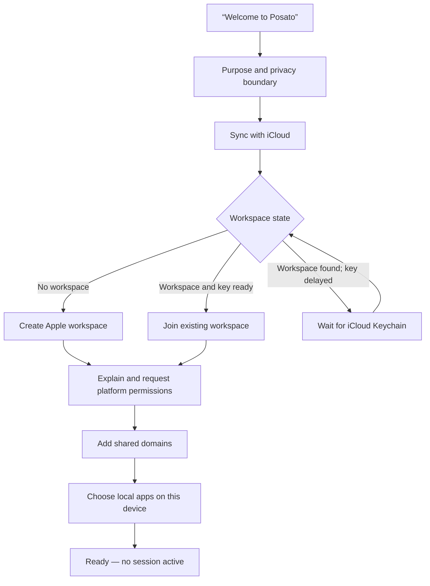
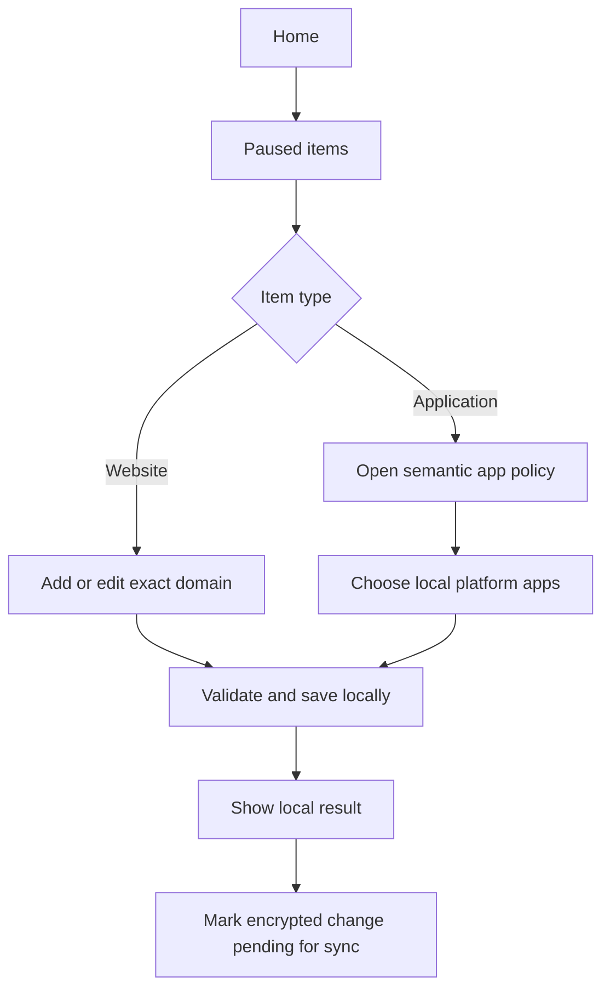
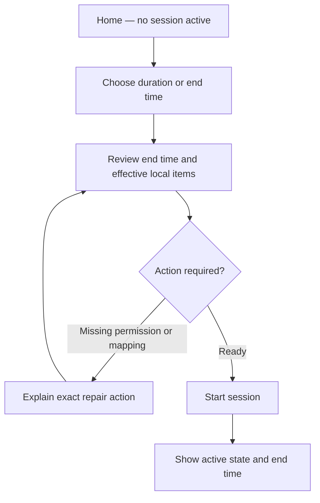
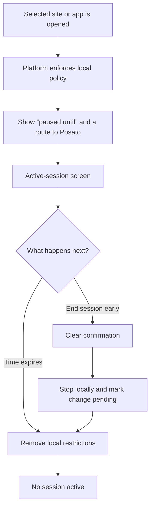
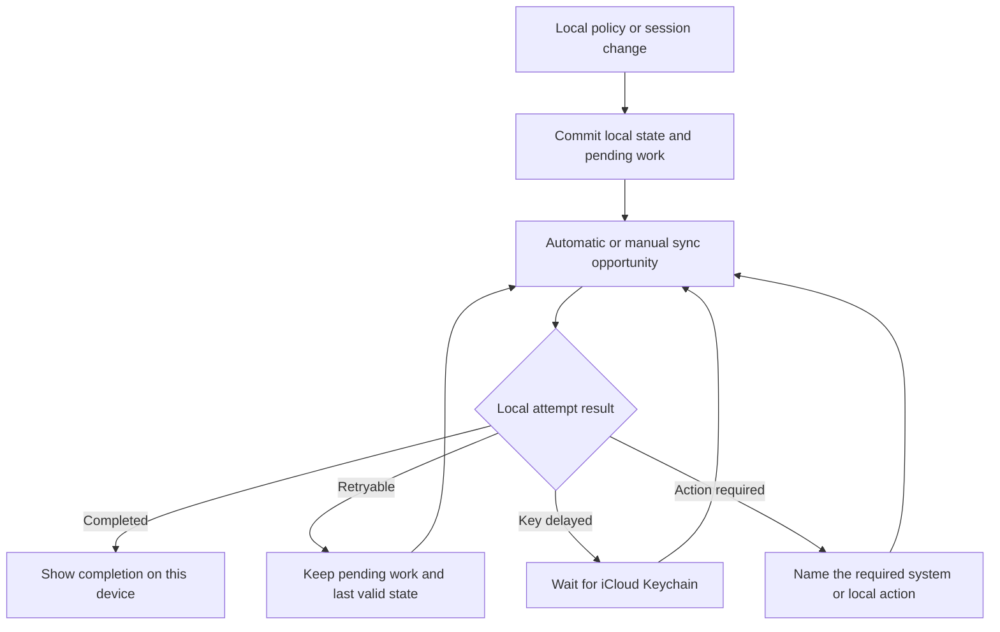
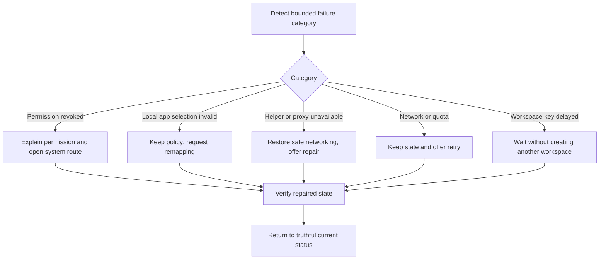

# Brand and Product Design Baseline Candidate

## Status and boundary

- **Status:** Proposed for Gate 3 acceptance
- **Prepared:** 2026-08-25
- **Provenance:** `inferred` from accepted product scope, identity, privacy
  boundaries, and current Apple design guidance
- **Decision authority:** none until the maintainer explicitly accepts or
  corrects this candidate

This candidate defines only enough brand and product design to keep the first
application shell and near-term MVP flows coherent. It does not finalize a
logo, custom typeface, illustration system, marketing site, launch campaign,
or complete component library.

## Recommended brand foundation

### Positioning

**Posato helps self-directed people interrupt automatic use of selected
websites and apps with calm, time-bounded limits across their own Apple
devices, without surveillance or a product account.**

### Primary audience

The primary audience is an adult who owns a Mac and iPhone, recognizes an
automatic digital habit, and wants deliberate friction under their own control.
Posato is not positioned as parental control, employee monitoring,
administrator security, or a productivity-scoring system.

### Promise and working line

- **Brand promise:** a quiet pause between impulse and action.
- **Working product line:** **Pause. Then choose.**

The product does not promise perfect prevention. It promises a clear,
respectful interruption and truthful state across the devices it supports.

### Personality

Posato is:

- calm, without drifting into wellness vagueness;
- respectful, without becoming passive;
- candid about platform limits and failure;
- precise about time, scope, and device state; and
- composed rather than playful or severe.

Posato is not punitive, paternalistic, moralizing, alarmist, gamified,
clinical, or framed around productivity guilt.

### Voice and product language

Use short, concrete sentences. Describe the current state first, the consequence
second, and an available action third. Address the person directly only when it
makes an action clearer. Never congratulate, shame, score, or diagnose them.

| Context | Recommended language | Avoid |
| --- | --- | --- |
| Inactive | “No session active.” | “You are unprotected.” |
| Active | “Session active until 18:30.” | “You are locked in.” |
| Blocked | “This site is paused until 18:30.” | “Access denied.” |
| Early end | “End session early” | “Give up” or “Break focus” |
| Local sync result | “Last sync completed on this device at 18:02.” | “Everything is synced.” |
| Key delay | “Waiting for iCloud Keychain. Your existing workspace remains unchanged.” | “Sync failed.” |
| Permission | “Posato needs Screen Time access to pause selected apps on this iPhone.” | “Permission required.” |

Use **session**, **paused**, **ends at**, **on this device**, **waiting**, and
**needs your attention** consistently. Reserve **blocked** for technical and
support contexts where precision outweighs tone. Do not use **detox**,
**addiction**, **discipline**, **streak**, or **failure** to describe a person.

## Recommended visual direction

### Concept: the calm interval

The defining visual idea is a visible interval between impulse and action. It
should feel like space deliberately opened, not a barrier imposed from outside.
Use restrained negative space, stable alignment, and one clear focal action.
Avoid shields, padlocks, stop signs, warning tape, flames, dopamine imagery,
achievement rings, and generic productivity dashboards.

### Base palette

These sRGB values are brand references, not instructions to replace Apple
semantic colors throughout the application.

| Token | Value | Intended role |
| --- | --- | --- |
| Posato Ink | `#18231F` | Primary brand text and dark neutral |
| Posato Paper | `#F5F2EA` | Warm light brand surface |
| Posato Moss | `#2E5D50` | Primary brand and application tint |
| Posato Clay | `#A54B35` | Secondary emphasis, never a generic error color |
| Posato Mist | `#DCE4DF` | Quiet supporting surface or illustration field |

`observed`: WCAG 2.x sRGB contrast calculations give 14.45:1 for Ink on
Paper, 6.71:1 for Moss on Paper, 7.51:1 for white on Moss, 5.13:1 for Clay on
Paper, and 5.74:1 for white on Clay. These pairs clear the 4.5:1 reference for
normal text, but every real component still requires state-specific contrast
testing.

Application surfaces and labels should use semantic system colors. Moss is the
single default tint for primary actions and selected state. Clay is a sparse
brand accent and must not compete with system warning or destructive colors.
Dark Mode and Increase Contrast require asset variants; candidate dark
references are `#121A17` for the deep surface, `#F7F5EF` for text,
`#76B29E` for Moss, and `#E49A82` for Clay.

### Typography

- Use the platform system typeface, San Francisco, through semantic text styles
  in the applications.
- Use Regular, Medium, and Semibold weights; do not use thin display weights.
- Let size, weight, and spacing create hierarchy; do not add a second typeface
  merely to make the brand feel distinctive.
- Support the full iOS Dynamic Type range. On macOS, use the system control and
  text styles appropriate to each native component.
- Use a system sans-serif stack for early web or repository materials. A custom
  brand typeface remains a later, separately licensed decision.

### Placeholder icon direction

Use a simple **open interval**: two softly weighted, asymmetric vertical forms
separated by deliberate negative space, with a subtle forward shift that
suggests pause followed by continued choice. It may echo a pause mark without
copying a media-control glyph. The mark must work in one color, contain no text,
and remain recognizable at small sizes. Final geometry, rendering layers, and
platform icon production remain deferred.

## Product interface baseline

### Shared hierarchy

Every primary surface answers, in order:

1. Is a session active?
2. When does the current state end or what requires attention?
3. What is paused on this device?
4. Is local work pending or was the latest sync attempt completed?
5. What is the single most useful action now?

Do not turn these answers into a grid of equal cards. Use one dominant status,
one primary action, and progressively disclosed details. A countdown is
supporting information, not an animated spectacle.

### Platform fit

- Share information hierarchy, state names, and core copy across macOS and
  iOS; do not force identical chrome or navigation.
- On iOS, keep the primary action comfortably reachable, limit simultaneous
  controls, use standard navigation and sheets, and adapt to Dynamic Type.
- On macOS, use a resizable system window, appropriate information density,
  menu commands, standard keyboard shortcuts, and keyboard-complete flows.
- Present the reason for a platform permission before the system prompt. Never
  imitate System Settings or claim that Posato granted a permission itself.
- Use system components and SF Symbols for interface actions. The custom mark
  belongs to product identity, not to every control.

### Accessibility baseline

- Meet WCAG 2.1 AA contrast as a minimum reference and test Apple appearance
  variants, including Dark Mode and Increase Contrast.
- Never use color alone for active, paused, pending, success, warning, or error
  state; pair it with text and, where useful, a distinct symbol.
- Support VoiceOver, Voice Control, Switch Control, Full Keyboard Access, and
  logical focus order for every primary flow.
- Target 44 by 44 point controls on iOS and 28 by 28 point controls on macOS;
  do not go below Apple's current platform minimums.
- Preserve essential content at accessibility text sizes. Reflow instead of
  truncating session end time, action-required reason, or primary action.
- Honor Reduce Motion. Do not animate countdown ticks, create urgency through
  motion, or auto-dismiss information needed for a decision.
- Announce meaningful state changes, not every countdown second or background
  retry.
- Make early termination deliberate through clear copy and confirmation, not
  through inaccessible gesture, tiny target, hidden focus, or time pressure.

## Low-fidelity flows

These diagrams specify state and action order, not final navigation, layout, or
component ownership.

### Onboarding

### Block-list management

### Manual session

### Active blocking and early termination

The attempted URL, allowed navigation, and application-usage timeline are not
stored to power this experience.

### Synchronization

Completion never claims that every other device has received the change.

### Failure and action-required recovery

## PR #1 design contract candidate

The application-skeleton screen can use the following exact content without
pretending that unfinished controls work:

- product name: **Posato**;
- primary line: **Pause. Then choose.**;
- supporting line: **A quiet pause between impulse and action.**; and
- build-state note: **This build contains the application shell only.**

Use the system background and label colors, system typography, and Posato Moss
as the sole tint. Do not add a navigation shell, dashboard cards, fake session
controls, gradients, illustrations, or the unfinished app icon to PR #1.

## Acceptance request

Gate 3 remains open until the maintainer explicitly accepts or corrects:

1. the positioning, audience, promise, and working line;
2. the personality, voice, and product vocabulary;
3. the palette, typography, and placeholder icon direction;
4. the shared hierarchy and platform-specific constraints;
5. the accessibility baseline and six low-fidelity flows; and
6. the exact PR #1 shell content.
